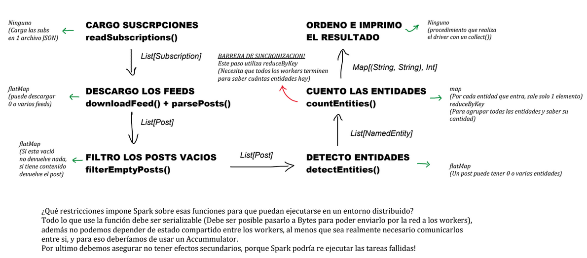

# Ejercicio 1 

## Diagrama de flujo 

    CARGA DE SUBSCRIPCIONES
    readSubscriptions()
            |
            |   List[Subscription]
            |
            V
    DESCARGA DE FEEDS 
    downloadFeed() + parsePosts()
            |
            |   List[Post]
            |
            V
    FILTRADO DE POSTS VACIOS
    filterEmptyPosts()
            |
            |   List[Post]
            |
            V        
    DETECCCION DE ENTIDADES
    detectEntities()
            |
            |   List[NamedEntity]
            |
            V
    CONTADOR DE ENTIDADES
    countEntities()
            |
            |   Map[(String, String), Int]
            |
            V 
ORDENACION E IMPRESION DEL RESULTADO

## Abstracciones en el Pipeline
(map, flatMap, reduceByKey )

Carga de subscripciones: No se puede expresar como una abstraccion.
Descarga de feeds(Puede descargar 0 o varios feeds): Se puede expresar con la abstraccion flatMap.
Filtrado de posts vacios(Si esta vacio no retorna nada, si tiene contenido retorna el post): Se puede expresar con la abstraccion
flatMap. 
Deteccion de entidades(Un post puede tener 0 o varias entidades): Se puede expresar con la abstraccion flatMap. 
Contador de entidades: Se puede expresar con 2 abstracciones, map (por cada entidad que entra, sale solo 1 elemento), y con reduceByKey (Para agrupar todas las entidades y saber la cantidad de cada una de ellas).
Ordenacion e impresion del resultado: No se puede expresar como una abstraccion.

La carga de subscrpiciones no se puede expresar como una abstraccion, porque lo que hace es cargar las subs en 1 archivo JSON.
La ordenacion e impresion del resultado no se puede expresar como una abstraccion, porque se realiza con un collect

## Barrera de sincronizacion

Todos los pasos del pipeline pueden ejecutarse de forma independiente entre workers, excepto el paso de contar entidades, pues este paso utiliza el reduceByKey, el cual necesita que todos los workers terminen para saber la cantidad de entidades que hay.

## Restricciones sobre funciones en un entrono distribuido

Todo lo que use la función debe ser serializable (Debe ser posible pasarlo a Bytes para poder enviarlo por la red a los workers),
además no podemos depender de estado compartido entre los workers, al menos que sea realmente necesario comunicar informacion al driver, y para eso deberíamos de usar un Accummulator.
Por ultimo debemos asegurar no tener efectos secundarios, porque Spark podría re ejecutar las tareas fallidas!

## Diagrama de flujo

 
Como un extra dejo el diagrama que hice antes de implementarlo aca!

## Ejercicio 2

## Excepcion en flatMap

Si no manejamos las excepciones entonces Spark re ejecutaria las tareas una cantidad configurable de veces. Si falla en todas entonces cancela todo, perdiendo todo el procesamiento de los feeds que si funcionaban.

## Ejercicio 3

## Impacto de reduceByKey en el cluster.

Spark tiene que juntar toidos los elementos de la misma clave, los cuales estan distribuidos en distintos workers. Para hacer esto hace un Shuffle, por lo que es inevitable porque para contar tenes que ver si o si todos los posts de todos los workers.

## Restricciones de reduceByKey 

Es necesario que se cumpla la asociatividad y la conmutatividad, pues Spark no garantiza el orden de llegada de los elementos que vienen de los distintos workers.

## Dictionary

El dictionary lo cargamos en el driver, especificamente con "Dictionary.loadAll()", pero luego Spark lo serializa y lo envia a cada worker cuando ejecutan el flatMap.

## Ejercicio 4

## Sobre Accummulators

Los accummulators los utilizamos cuando vamos a trabajar con workers, pero si una tarea falla y Spark la re-ejecuta, el accummulator se incrementaria las veces que se ejecute esa tarea. Por esta razon no son confiables para tomar decisiones logicas.
Ademas los valores del accummulators estaran disponibles para ser leidos luego de que se ejecute alguna accion terminal.

## Comparacion de tiempos

Salida del esqueleto: [success] Total time: 23 s, completed 3 jun 2026, 16:49:08
Salida del programa luego del ej 4: [info] Tiempo total de ejecución: 36.228 segundos
                                    [success] Total time: 45 s, completed 11 jun 2026 19:50:29
El tiempo de sbt incluye compilación e inicialización, mientras que nuestra medición con System.currentTimeMillis() captura solo el tiempo real del pipeline. Manejamos el triple de posts y el tiempo claramente aumentó moderadamente.
Sin embargo, la versión con Spark no es más rápida que el esqueleto secuencial en este caso. Esto se debe al overhead de inicialización de Spark que para datasets pequeños supera el beneficio de la paralelización. La ventaja de Spark se apreciaría con miles de feeds procesados en paralelo, donde ese costo fijo se amortiza.

## Ejercicio 5

## Influencia de Cache

Sin usar .cache(), cada accion terminal se recomputaria el pipeline completo desde el principio. En nuestro caso downloadResults se recomputaria al menos 6 veces. Al utilizar .cache(), solo lo haria 1 vez. 
## Llamadas a collect

Si llamaramos a .collect() entre un flatMap y un Map, traeriamos a todos los datos al driver, lo cual en un dataset grande podriamos agotar la memoria. Además el map y reduceByKey siguientes correrían en el driver de forma secuencial, perdiendo toda la distribución del trabajo.

## Almacenamiento en memoria de cache

Al ser lazy se va a almacenar en memoria a la primera vez que se le ejecute una accion terminal sobre el. En nuestro caso seria cuando se hace downloadResults.count()
